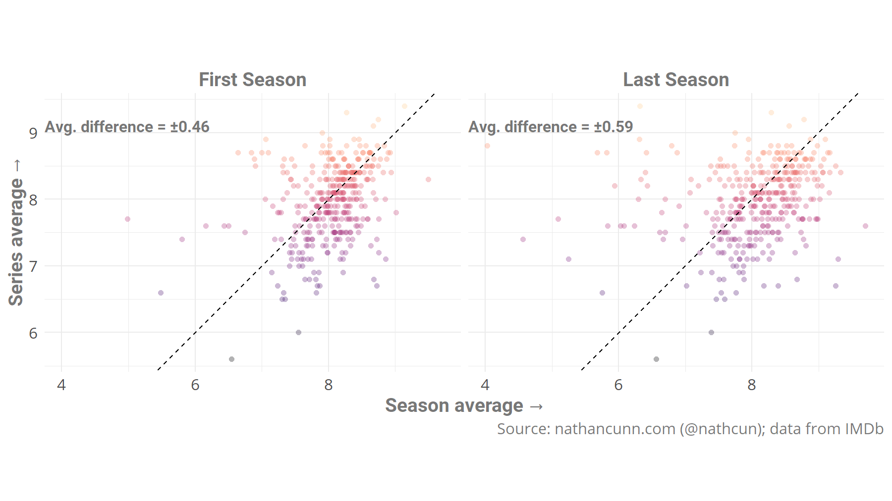
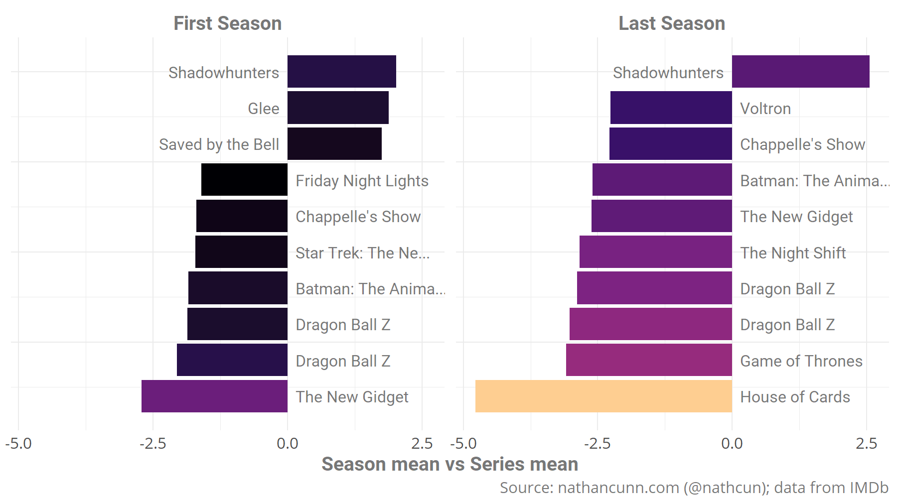

In _Thinking Fast and Slow_ Daniel Kahnemann and Amos Tversky outlined an experiment in which they asked participants to place their hand in a bowl of cold water. In one trial they were asked to remove their hand after 60 seconds and rate the discomfort they suffered. In the other, they endured the same experience, but also an additional 30 seconds in which the water was marginally less cold. The total discomfort experienced in the second experiment is objectively greater, being the sum of the original experiment plus some additional, albeit more moderate, discomfort. Despite this, participants rated the second experiment as causing less distress, choosing to repeat it over the first.

This got me thinking about TV, of course. With one of the biggest TV productions of recent years, Game of Thrones, ending to almost universal criticism, did we let that sour taste flavour the rest of what was, at times, an excellent show? Or when it comes to TV shows, are first impressions more important than final impressions?



It appears that the opening season of a show is typically rated _marginally_ closer to the overall show's average, than the final season, and so it could be argued that it is a little more important. It appears as though we are slightly more forgiving of a dud final season when it comes to forming our overall opinion of a show. It may also be that people cast their votes for the show as a whole, long before the show ever finishes and don't reconsider their decision, regardless of how it ends.

It's interesting that in both cases, we tend to rate the show overall as better than either season individually. This may be that shows typically have better middles than ends, or that it's easier to gloss over the bad when we look to rate the show as a whole. It should be noted that IMDb ratings for a show as a whole are seemingly somewhat separate from episode ratings, rather than being a weighted average of the individual episode ratings.

If we look at the shows with the largest discrepancies between the season average and the series average, the majority show the season being poorer than our memory of the show itself. The largest negative discrepancies also belong to the final seasons, reinforcing the idea that we tend to be more forgiving of final seasons, with little surprises in the shows whose final seasons fell furthest below their expectations.




_This analysis was done in R, with plots generated in ggplot2, details of the analysis are below. The data come from IMDb_

## Data
I gathered the data from [IMDb](https://datasets.imdbws.com/). What we need are actually spread across a few different tables: `title.ratings`, `title.episode`, and `title.basics`, so they all need to be downloaded and extracted on your machine. They can be read into R using the `tidyverse` package:

```r
library(tidyverse)
ratings <- read_delim("~/../Downloads/title.ratings.tsv/data.tsv", delim = "\t", na = "\\N")
basics <- read_delim("~/../Downloads/title.basics.tsv/data.tsv", delim = "\t", na = "\\N")
episode <- read_delim("~/../Downloads/title.episode.tsv/data.tsv", delim = "\t", na = "\\N")
```

Next we need to extract just the TV series from basics, as it contains episodes, films, and others. We'll then add the ratings for each of these shows by joining the `ratings` table. This also gives the number of votes, which we want to filter so that we only keep shows where >100 ratings were made, so that the results aren't being distorted by small shows with unrepresentative average ratings.

``` r
tvSeries <- basics %>%
  filter(titleType == "tvSeries") %>%
  left_join(., ratings, by = "tconst") %>%
  filter(numVotes >= 100)
```

Next, we need to select the episodes corresponding to TV shows in `tvSeries` table, and then merge the episodes data with the series data. And finally we'll remove any shows where an episode in the first or last season has fewer than 100 votes.

``` r
eps <- episode %>%
  filter(parentTconst %in% tvSeries$tconst) %>%
  left_join(., ratings, by = "tconst") %>%
  # We need to rename some variables as
  # tconst means episode ID in episode table
  # but tconst means series ID in tvSeries table
  select(epconst = "tconst",
         tconst = "parentTconst",
         epRating = "averageRating",
         epVotes = "numVotes",
         seasonNumber,
         episodeNumber) %>%
  # Join with tvSeries to get series rating
  inner_join(., tvSeries, by = "tconst") %>%
  na.omit() %>%
  group_by(tconst, seasonNumber) %>%
  # Get minimum votes for a single episode in a season
  mutate(min_votes = min(epVotes)) %>%
  ungroup() %>%
  group_by(tconst) %>%
  mutate(max_season = max(seasonNumber, na.rm = TRUE),
         last_season = (seasonNumber == max_season),
         pilot = seasonNumber == 1) %>%
  ungroup() %>%
  # Remove all but the first and last seasons
  filter(max_season > 1,
         last_season | pilot) %>%
  na.omit() %>%
  group_by(tconst) %>%
  # Remove shows where any episode had fewer than 100 ratings
  mutate(min_votes = min(min_votes)) %>%
  filter(min_votes >= 100)

```
