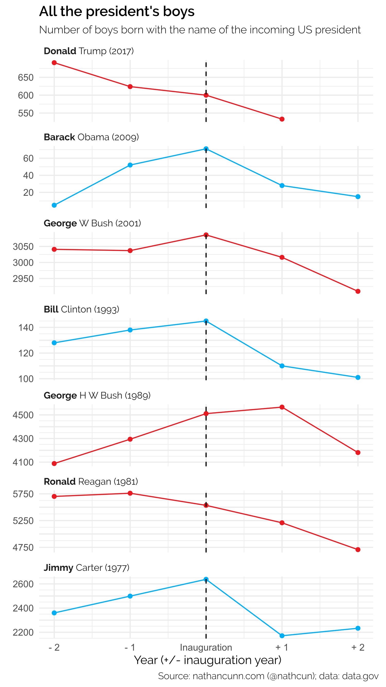

Nominative determinism is the idea that people gravitate towards professions which align with their names: Mr/s Baker becoming a baker, Usain _Bolt_ becoming a runner, and so on. While it is often little more than an [amusing coincidence](https://www.buzzfeed.com/robinedds/genius-examples-of-nominative-determinism), the perceived ability of names to shape our destinies has led some parents to naming their children for success.

Steven Levitt and Stephen Dubner discussed this in _Freakonomics_, ultimately concluding that varying success across names can be explained largely by differential naming patterns across socioeconomic groups. The names themselves do not confer any special powers. In particular, they discuss a father who named two of his sons Loser and Winner; Winner lived the life of a career criminal while Loser joined the NYPD. Other research on how your name can impact your academic achievement was done---seriously---by a [Dr Marijuana Pepsi Jackson](https://thehill.com/blogs/blog-briefing-room/news/449573-a-woman-named-marijuana-pepsi-earns-doctoral-degree-with).

I'm less interested in the effects and more interested in the occurrence: do parents _really_ name their kids for success? I looked into this by comparing the number of boys born in the US sharing the name of the president in their year of inauguration. The US president is---at least theoretically---a person worthy of admiration among Americans, a paragon of success. It stands to reason, therefore, that a parent aiming to set their children up for a life of success will name their child after this person.

Data on the frequency of names given to boys every year since 1880 are available [here](https://catalog.data.gov/dataset/baby-names-from-social-security-card-applications-national-level-data). Conveniently, American presidents are inaugurated in January, so I credit to them any peak in boys sharing their name in the year of their first inauguration. I only go as far back as Jimmy Carter, as his predecessor, Gerald Ford, was sworn in in August because of Nixon's resignation. Nixon himself succeeded Lyndon B Johnson who was sworn in in November due to John F Kennedy's assassination. So, prior to Carter, it becomes a little more difficult to assign the credit to an individual year.

In all but two cases, the year of inauguration coincided with an increase in the popularity of the incoming president's name. What does this mean for the other two, Donald Trump and Ronald Reagan? Are they just presidents who, despite winning, didn't earn the admiration of voters? Well, perhaps, but there are plenty of other reasons. The most obvious reason that parents don't want their children sharing any part of their name with the McDonald's mascot. Of course, there are actual reasons too. Perhaps those who elected these candidates were typically older/younger and therefore less likely to be having children which they could name after their new president. Perhaps Republicans are less likely to buy into the cult of personality surrounding US presidents. Although, this is somewhat undermined by the increase associated with the two Bushes and, well, everything surrounding Trump right now.

Or, maybe this is all just random variation. The number of boys born with a particular first name will go up or down every year. If we assume that it's equally likely for each of these situations (assuming that the chance of the exact same number being born year-on-year is negligible) then this is basically a coin toss experiment. I've never mentioned the magnitude of the changes, just the direction. In the data shown, five out of seven presidents showed an increase in popularity of their name in their year of inauguration. If we assume that to claim a relationship between the inauguration and the spike in the name we would need to see a spike in five or more cases, the evidence actually would be weak, as this would occur almost 23% of the time. As always, correlation not causation.

This analysis was done using `ggplot2` in R, the data are from [data.gov](http://www.data.gov).
