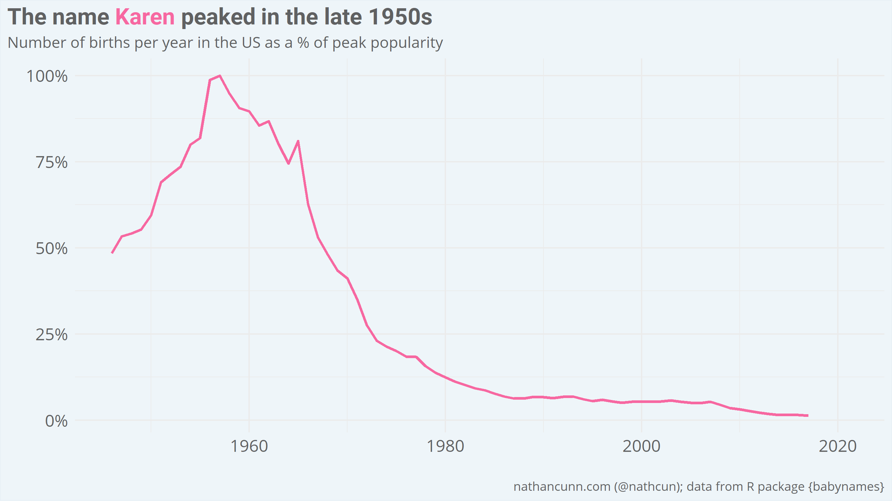
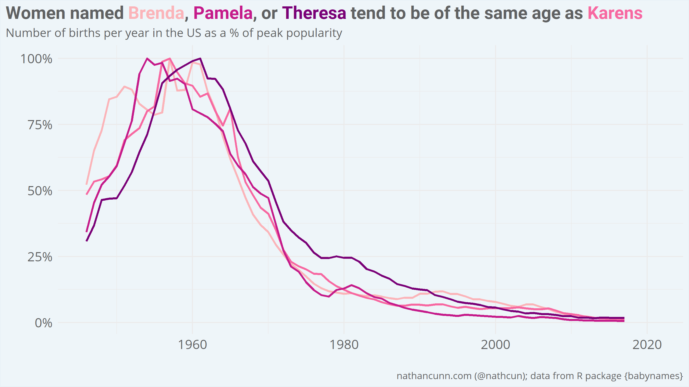
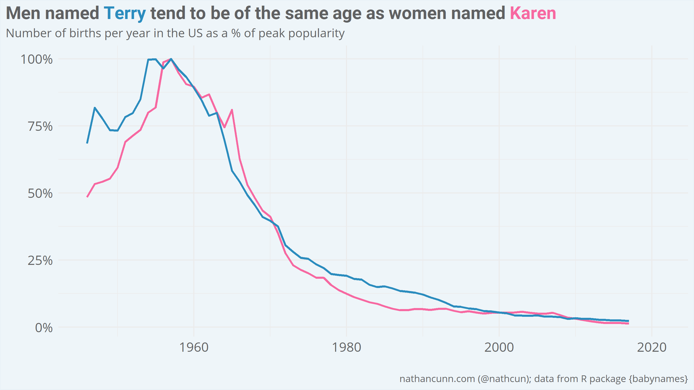
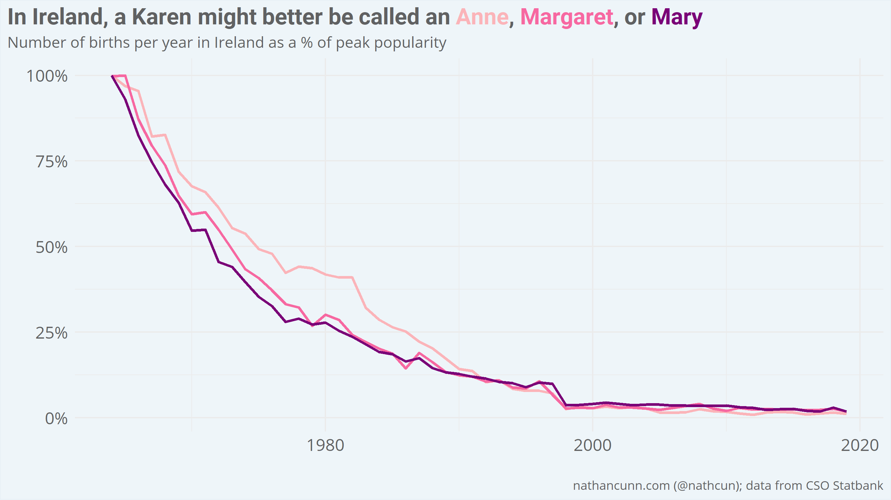

The Covid-19 pandemic has shed an unflattering light on the subset of society who, when faced with a minor inconvenience, will loudly proffer their opinion that perhaps it would be better if some other people died. This extreme entitlement is often personified in American and internet culture as _Karen_.

The _Karen_ archetype, to be clear, predates the pandemic and is more generally used to describe a middle-aged, white, often-racist, always-entitled woman. It's not entirely clear why Karen became the de facto name for entitlement, but part of it may be that it's a name which we distinctly associate with women of a certain age: the name Karen surged in popularity in the late 1950s before a decline in the late 1960s, covering a lot of what we now know as the _baby boomer_ generation.

On the other hand, women named Brenda, Pamela, or Theresa (among others) might count themselves lucky not to have been landed with the entitlement label.
Of names associated with greater than 250,000 births since 1945, these exhibit the most similar pattern to Karen. The relative ubiquity of Karens, might be why they were spared (>880,000 Karens born since 1945, in contrast with >556,000 Brendas, >569,00 Pamelas, and >285,000 Theresas).

Entitlement and privilege are, obviously, not distinctly female traits, and so men named Terry might also consider themselves lucky to have avoided the stigma; the name accounts for >338,000 men and went in and out of vogue at much the same time as Karen. As an aside if you look only at names relating to >500,000 births since 1945 the closest match is Donald.

The Karen meme has always felt a little out of place in Ireland. It may be that the stereotype doesn't translate as well, or it may be that the stereotype doesn't match the Karens we have. Looking at births in Ireland, from the CSO Statbank data, it's clear to see why the stereotype feels somewhat off: our Karens are typically younger than those in the US, with the name not reaching its peak until 20 years after it did in the US (1977 vs 1957).

So, what to call an Irish Karen? What we want to find is a name which is distinctly associated with women of a certain age. As the Irish data only begin in 1964, I can't look for names which peaked in the late 50s-early 60s. Instead, I looked at those names with the oldest expected age i.e. those which are most strongly associated with older generations. To avoid picking out names which were most popular a long time ago, but weren't particularly popular in general, I limited my search here to names associated with at least 10,000 births since 1964.

What's interesting here is that the name most associated with the older generation, Anne/Ann, is one of the [predecessors to the Karen stereotype in the US](https://www.npr.org/2020/07/14/891177904/whats-in-a-karen?t=1597391851486) (a _Miss Ann_). Perhaps, as with Karens, we're simply lagging the US on this front. As my own mother is a Margaret, I'll leave it up to you whether you believe Annes, Margarets, and Marys fit the Karen stereotype.

As for male names in Ireland, the trend is a little less clear. The names with the oldest expected age for men in Ireland are Declan, Gerard, and Paul, however, their names maintained the same relative popularity for a longer period than their female counterparts.

The analysis was done using R and visualised using ggplot2. If you, for some reason, have a thing for reading analyses of birth name data you might want to check out my post on [how US president's names influence name popularity](http://www.nathancunn.com/2019-10-03-all-the-presidents-boys/) or how [Hurricane Katrina caused a decline in the popularity of the name Katrina](http://www.nathancunn.com/2017-09-10-hurricane-katrina/).
